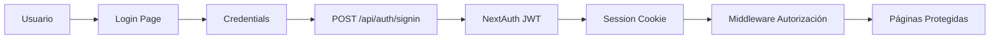

# Guía de Implementación: Autenticación y Autorización

**Versión:** 1.0
**Fecha:** 2026-03-07
**Sistema:** GMAO Hiansa - Gestión de Mantenimiento
**Modelo:** PBAC (Permission-Based Access Control)

---

## 📋 Tabla de Contenidos

1. [Arquitectura General](#1-arquitectura-general)
2. [Modelo PBAC](#2-modelo-pbac)
3. [Patrones de Autenticación](#3-patrones-de-autenticación)
4. [Patrones de Autorización](#4-patrones-de-autorización)
5. [Implementación de Features Seguras](#5-implementación-de-features-seguras)
6. [Errores Comunes](#6-errores-comunes)
7. [Checklist de Revisión](#7-checklist-de-revisión)

---

## 1. Arquitectura General

### 1.1 Stack Tecnológico

```
Next.js 15 (App Router)
├── NextAuth.js (v5) - Autenticación
├── Prisma ORM - Base de datos
├── PostgreSQL - Base de datos
├── TypeScript - Type safety
└── Vitest - Testing framework
```

### 1.2 Flujo de Autenticación



### 1.3 Sesiones de Usuario

**Session Cookie Structure:**
```typescript
{
  user: {
    id: string,
    email: string,
    name: string | null,
    isFirstLogin: boolean
  },
  expires: ISO Date,
  // NOTA: capabilities NO se almacenan en sesión por seguridad
}
```

---

## 2. Modelo PBAC

### 2.1 Conceptos Clave

**RBAC (Role-Based Access Control) vs PBAC (Permission-Based Access Control):**

| Aspecto | RBAC (Antes) | PBAC (Actual) |
|---------|--------------|---------------|
| Capacidades | En roles | Directamente en usuarios |
| Roles | Estructura de autorización | Solo etiquetas de clasificación |
| Herencia | Usuarios heredaban de roles | N/A - Sin herencia |
| Flexibilidad | Baja | Alta - Granularidad por usuario |

### 2.2 Esquema de Base de Datos

```prisma
model User {
  id                String    @id @default(cuid())
  name              String?
  email             String    @unique
  passwordHash      String
  isFirstLogin      Boolean   @default(true)
  roles             UserRole[]      // Roles como etiquetas
  capabilities      UserCapability[] // ← Capabilities directas
  createdAt        DateTime  @default(now())
  updatedAt        DateTime  @updatedAt

  @@map("users")
}

model Role {
  id          String   @id @default(cuid())
  name        String   @unique
  description String?
  isSystem    Boolean  @default(false) @map("is_system_role")
  users       UserRole[] // ← NO tiene capabilities relation

  @@map("roles")
}

model UserCapability {
  user         User       @relation(fields: [userId], references: [id], onDelete: Cascade)
  capability   Capability @relation(fields: [capabilityId], references: [id], onDelete: Cascade)
  userId       String
  capabilityId String

  @@id([userId, capabilityId])
  @@map("user_capabilities")
}

model UserRole {
  user   User @relation(fields: [userId], references: [id], onDelete: Cascade)
  role   Role @relation(fields: [roleId], references: [id], onDelete: Cascade)
  userId String
  roleId String

  @@id([userId, roleId])
  @@map("user_roles")
}

model Capability {
  id               String           @id @default(cuid())
  name             String           @unique
  description      String?
  userCapabilities UserCapability[] // ← Solo relación con usuarios

  @@map("capabilities")
}
```

### 2.3 Capacidades del Sistema (9 en Total)

```typescript
// Capabilities del sistema (PBAC)
const SYSTEM_CAPABILITIES = [
  'can_create_failure_report',    // PREDETERMINADA - Todos los usuarios
  'can_create_manual_ot',          // Crear OT manualmente
  'can_update_own_ot',              // Actualizar OT asignadas
  'can_view_own_ots',              // Ver solo OTs asignadas (NUEVA en PBAC)
  'can_view_all_ots',              // Ver TODAS las OTs
  'can_complete_ot',               // Completar OT
  'can_manage_stock',              // Gestionar stock de repuestos
  'can_assign_technicians',       // Asignar técnicos
  'can_view_kpis'                  // Ver dashboard de KPIs
] as const;
```

**NOTA CRÍTICA:** En PBAC, `Role` NO tiene relación con `Capability`. Los roles son SOLO etiquetas de clasificación (ej: "Administrador", "Técnico").

---

## 3. Patrones de Autenticación

### 3.1 Verificar Usuario Autenticado (Server-Side)

```typescript
import { getServerSession } from 'next-auth';
import { redirect } from 'next/navigation';
import { authOptions } from '@/lib/auth';

export default async function MyPage() {
  // 1. Verificar autenticación
  const session = await getServerSession(authOptions);

  // 2. Redirigir si no autenticado
  if (!session?.user?.id) {
    redirect('/login');
  }

  // 3. Usuario autenticado - renderizar página
  return <div>Hola, {session.user.name}</div>;
}
```

### 3.2 Obtener Usuario con Capacidades (Server-Side)

```typescript
import { prisma } from '@/lib/prisma';

// ✅ CORRECTO - PBAC: Obtener capabilities directas del usuario
const user = await prisma.user.findUnique({
  where: { id: session.user.id },
  include: {
    capabilities: {
      select: {
        name: true,
      },
    },
  },
});

// ✅ CORRECTO - Extraer capabilities del usuario
const capabilities = user?.capabilities.map(cap => cap.name) ?? [];

// ❌ INCORRECTO - NO usar roles para capabilities (RBAC antiguo)
// const capabilities = user.roles.flatMap(r => r.role.capabilities.map(c => c.capability.name));
```

### 3.3 Verificar Autenticación en API Routes

```typescript
import { getToken } from 'next-auth/jwt';
import { NextRequest, NextResponse } from 'next/server';
import { prisma } from '@/lib/prisma';

export async function GET(request: NextRequest) {
  // 1. Verificar token JWT
  const token = await getToken({
    req: request,
    secret: process.env.NEXTAUTH_SECRET,
  });

  if (!token?.id) {
    return NextResponse.json(
      { error: 'No autenticado' },
      { status: 401 }
    );
  }

  // 2. Obtener usuario con capabilities
  const user = await prisma.user.findUnique({
    where: { id: token.id as string },
    include: {
      capabilities: {
        select: {
          name: true,
        },
      },
    },
  });

  if (!user) {
    return NextResponse.json(
      { error: 'Usuario no encontrado' },
      { status: 404 }
    );
  }

  // 3. Continuar con la lógica...
  return NextResponse.json({ user: { id: user.id, email: user.email } });
}
```

---

## 4. Patrones de Autorización

### 4.1 Verificar Capability del Usuario

```typescript
// ✅ CORRECTO - PBAC: Verificar capability del usuario
import { getUserCapabilities } from '@/lib/auth/utils';

// En Server Component o API Route:
const user = await prisma.user.findUnique({
  where: { id: session.user.id },
  include: {
    capabilities: {
      select: { name: true },
    },
  },
});

// Verificar capability específica
const canAssignTechnicians = user?.capabilities.some(
  cap => cap.name === 'can_assign_technicians'
);

if (!canAssignTechnicians) {
  redirect('/unauthorized');
}
```

### 4.2 Helper Function para Obtener Capabilities

**Crear:** `src/lib/auth/utils.ts`

```typescript
import { prisma } from '@/lib/prisma';

/**
 * Obtiene las capabilities de un usuario
 * @param userId - ID del usuario
 * @returns Array de nombres de capabilities
 */
export async function getUserCapabilities(
  userId: string
): Promise<string[]> {
  const user = await prisma.user.findUnique({
    where: { id: userId },
    include: {
      capabilities: {
        select: {
          name: true,
        },
      },
    },
  });

  if (!user) {
    return [];
  }

  return user.capabilities.map(cap => cap.name);
}
```

### 4.3 Middleware de Autorización por Capability

```typescript
// ✅ CORRECTO - PBAC: Middleware de autorización
import { NextRequest, NextResponse } from 'next/server';
import { getToken } from 'next-auth/jwt';
import { prisma } from '@/lib/prisma';

export async function requireCapability(
  request: NextRequest,
  capabilityName: string
): Promise<{ userId: string } | NextResponse> {
  // 1. Verificar autenticación
  const token = await getToken({
    req: request,
    secret: process.env.NEXTAUTH_SECRET,
  });

  if (!token?.id) {
    return NextResponse.json(
      { error: 'No autenticado' },
      { status: 401 }
    );
  }

  // 2. Obtener capabilities del usuario
  const user = await prisma.user.findUnique({
    where: { id: token.id as string },
    include: {
      capabilities: {
        select: { name: true },
      },
    },
  });

  if (!user) {
    return NextResponse.json(
      { error: 'Usuario no encontrado' },
      { status: 404 }
    );
  }

  // 3. Verificar capability requerida
  const hasCapability = user.capabilities.some(
    cap => cap.name === capabilityName
  );

  if (!hasCapability) {
    return NextResponse.json(
      { error: 'No tienes permisos' },
      { status: 403 }
    );
  }

  // 4. Usuario autorizado - retornar userId
  return { userId: user.id };
}

// Uso en API Route:
export async function POST(request: NextRequest) {
  // Verificar can_assign_technicians
  const auth = await requireCapability(request, 'can_assign_technicians');

  if (auth instanceof NextResponse) {
    return auth; // Error 401 o 403
  }

  const { userId } = auth;

  // Continuar con la lógica...
}
```

### 4.4 Verificación de Autorización en Componentes Cliente

```typescript
'use client';

import { useSession } from 'next-auth/react';
import { useRouter } from 'next/navigation';

export function MyProtectedComponent() {
  const { data: session, status } = useSession();
  const router = useRouter();

  useEffect(() => {
    // ✅ CORRECTO - PBAC: Verificar capabilities de la sesión
    if (session?.user?.capabilities?.includes('can_view_all_ots')) {
      // Usuario tiene permiso - renderizar componente
    } else {
      // Usuario NO tiene permiso - redirigir
      router.push('/unauthorized');
    }
  }, [session, router]);

  if (status === 'unauthenticated') {
    return <div>Debes iniciar sesión</div>;
  }

  return <div>Contenido protegido</div>;
}
```

**IMPORTANTE:** Las capabilities en la sesión NextAuth son solo para UI defensiva. La autorización REAL siempre debe ser server-side.

---

## 5. Implementación de Features Seguras

### 5.1 Crear Nueva Página Protegida

```typescript
// src/app/admin/roles/page.tsx
import { getServerSession } from 'next-auth';
import { redirect } from 'next/navigation';
import { authOptions } from '@/lib/auth';
import { prisma } from '@/lib/prisma';

export default async function RolesPage() {
  // 1. Verificar autenticación
  const session = await getServerSession(authOptions);

  if (!session?.user?.id) {
    redirect('/login');
  }

  // 2. Obtener usuario con capabilities
  const user = await prisma.user.findUnique({
    where: { id: session.user.id },
    include: {
      capabilities: {
        select: {
          name: true,
        },
      },
    },
  });

  // 3. Verificar can_assign_technicians
  const hasCapability = user?.capabilities.some(
    cap => cap.name === 'can_assign_technicians'
  );

  if (!hasCapability) {
    redirect('/kpis'); // Redirigir a página default
  }

  // 4. Usuario autorizado - continuar...
  const roles = await prisma.role.findMany({
    include: {
      _count: {
        select: { users: true },
      },
    },
    orderBy: { name: 'asc' },
  });

  return (
    <div>
      <h1>Gestión de Roles</h1>
      {/* Renderizar roles... */}
    </div>
  );
}
```

### 5.2 Registrar Usuario con Roles y Capabilities

```typescript
// ✅ CORRECTO - PBAC: Crear usuario con roles + capabilities
const newUser = await prisma.user.create({
  data: {
    email: 'usuario@example.com',
    passwordHash: hashedPassword,
    name: 'Usuario de Prueba',
    isFirstLogin: true,

    // Roles: SOLO etiquetas de clasificación
    roles: {
      create: [
        { roleId: tecnicoRole.id }
      ]
    },

    // Capabilities: Asignadas directamente
    capabilities: {
      create: [
        { capabilityId: canCreateFailureReportCapability.id },
        { capabilityId: canViewOwnOtsCapability.id },
        { capabilityId: canCompleteOtCapability.id }
      ]
    }
  }
});
```

### 5.3 Navigation Basada en Capacidades

**Componente de Navegación:**

```typescript
// src/components/layout/Navigation.tsx
import { useSession } from 'next-auth/react';

export function Navigation() {
  const { data: session } = useSession();
  const capabilities = session?.user?.capabilities || [];

  return (
    <nav>
      <NavItem href="/dashboard">Dashboard</NavItem>

      {/* Mostrar solo si usuario tiene capability */}
      {capabilities.includes('can_view_all_ots') && (
        <NavItem href="/work-orders/my-ots">Ver TODAS las OTs</NavItem>
      )}

      {capabilities.includes('can_create_manual_ot') && (
        <NavItem href="/work-orders/new">Crear OT Manual</NavItem>
      )}

      {capabilities.includes('can_assign_technicians') && (
        <NavItem href="/users">Gestión de Usuarios</NavItem>
      )}

      {capabilities.includes('can_manage_stock') && (
        <NavItem href="/spare-parts">Repuestos</NavItem>
      )}

      {capabilities.includes('can_view_kpis') && (
        <NavItem href="/kpis">KPIs</NavItem>
      )}
    </nav>
  );
}
```

---

## 6. Errores Comunes

### 6.1 ❌ NO Usar `role.capabilities`

```typescript
// ❌ INCORRECTO - RBAC antiguo (NO existe en PBAC)
const capabilities = user.roles.flatMap(
  r => r.role.capabilities.map(c => c.capability.name)
);

// ❌ INCORRECTO - Validar capabilities desde roles
if (user.role.capabilities.some(rc => rc.capability.name === 'can_assign_technicians')) {
  // ...
}
```

### 6.2 ❌ NO Incluir `capabilities` en Queries de Roles

```typescript
// ❌ INCORRECTO - Role NO tiene capabilities en PBAC
const roles = await prisma.role.findMany({
  include: {
    capabilities: {  // ❌ Esto fallará - Role no tiene capabilities
      include: {
        capability: true
      }
    }
  }
});

// ✅ CORRECTO - Roles solo tienen usuarios
const roles = await prisma.role.findMany({
  include: {
    _count: {
      select: { users: true }
    }
  }
});
```

### 6.3 ❌ NO Almacenar capabilities en Sesión NextAuth

**Configuración NextAuth INCORRECTA:**

```typescript
// ❌ INCORRECTO - NO almacenar capabilities en sesión
export const authOptions: NextAuthOptions = {
  callbacks: {
    async session({ session, user }) {
      return {
        ...session,
        user: {
          ...user,
          capabilities: user.capabilities  // ❌ No hacer esto
        }
      };
    }
  }
};
```

**✅ CORRECTO - No incluir capabilities en la sesión:**

```typescript
export const authOptions: NextAuthOptions = {
  callbacks: {
    async session({ session, user }) {
      return {
        ...session,
        user: {
          ...user
          // ✅ NO incluir capabilities - obtener del servidor siempre
        }
      };
    }
  }
};
```

### 6.4 ❌ NO Consultar `RoleCapability`

```typescript
// ❌ INCORRECTO - RoleCapability NO existe en PBAC
await prisma.roleCapability.deleteMany({ ... });

// ❌ INCORRECTO - RoleCapability en queries
const role = await prisma.role.findUnique({
  where: { id: roleId },
  include: {
    capabilities: {  // ❌ Esto fallará
      include: {
        capability: true
      }
    }
  }
});
```

---

## 7. Checklist de Revisión

Al implementar una nueva feature que requiera autenticación/autorización, verificar:

### 7.1 Autenticación
- [ ] ¿Verifico `session?.user?.id` en páginas protegidas?
- [ ] ¿Redirige a `/login` si no autenticado?
- [ ] ¿Obtiene usuario de DB con `prisma.user.findUnique`?
- [ ] ¿Valida `getToken` en API routes?

### 7.2 Autorización PBAC
- [ ] ¿Obtiene `user.capabilities` en lugar de `role.capabilities`?
- [ ] ¿Verifica capabilities con `user.capabilities.some()`?
- [ ] ¿Usa middleware `requireCapability()` para reutilizar lógica?
- [ ] ¿Verifica autorización server-side (no solo cliente)?

### 7.3 Seguridad
- [ ] ¿NO almacena capabilities en sesión NextAuth?
- [ ] ¿Siempre valida autorización en el servidor?
- [ ] ¿Usa `select: { name: true }` para optimizar queries?
- [ ] ¿Maneja properly errores 401/403/404?

### 7.4 Tests
- [ ] ¿Mockean sesiones con `capabilities: ['can_xxx']`?
- [ ] ¿Tests de autorización usan modelo PBAC?
- [ ] ¿NO incluyen `role.capabilities` en los tests?

### 7.5 Documentación
- [ ] ¿Documenta las capabilities requeridas para cada feature?
- [ ] ¿Actualiza diagramas si agrega nuevas capabilities?
- [ ] ¿Comenta código complejo de autorización?

---

## 8. Referencias Rápidas

### 8.1 Rutas de Archivos Clave

```
Autenticación:
- src/lib/auth.ts - Configuración NextAuth
- src/app/api/auth/[...nextauth]/route.ts - Endpoints NextAuth
- src/app/api/auth/signin/page.tsx - Login page
- src/app/api/auth/signout/page.tsx - Logout page

Autorización:
- src/lib/auth/utils.ts - Helper functions
- src/middleware.ts - Middleware global (opcional)
- Componentes que verifican session.user.capabilities

Base de Datos:
- prisma/schema.prisma - Esquema PBAC
- prisma/seed.ts - Datos de prueba
```

### 8.2 Commands Útiles

```bash
# Resetear base de datos (borra TODO y vuelve a crear)
npx prisma db seed

# Ver usuarios con capabilities
npx prisma db studio

# Correr tests de autenticación
npm test tests/api/auth

# Correr tests de autorización
npm test tests/e2e/admin
```

---

## 9. Troubleshooting

### 9.1 Error: "Unknown field `capabilities` for include statement on model `Role`"

**Causa:** Intentando incluir `capabilities` en query de Prisma de `Role`.

**Solución:**
```typescript
// ❌ INCORRECTO
const role = await prisma.role.findUnique({
  include: { capabilities: { ... } }  // Error
});

// ✅ CORRECTO - Roles NO tienen capabilities en PBAC
const role = await prisma.role.findUnique({
  include: { _count: { select: { users: true } } }
});
```

### 9.2 Error: "Cannot read property 'capabilities' of undefined"

**Causa:** Intentando acceder a `role.capabilities` que ya no existe.

**Solución:** Buscar en el código todos los accesos a `role.capabilities` y reemplazar por `user.capabilities`.

### 9.3 Tests fallando con "Admin role not found"

**Causa:** Nombres de roles en español (`Administrador`) vs inglés (`Admin`).

**Solución:** Usar nombres correctos del seed:
- `Administrador` (no `Admin`)
- `Supervisor de Mantenimiento` (no `Supervisor`)
- `Técnico de Mantenimiento` (no `Técnico`)
- `Operario` (correcto)

---

## 10. Evolución de RBAC a PBAC

### 10.1 ¿Por qué cambiamos a PBAC?

**Limitaciones de RBAC:**
- Roles rígidos: Todos los usuarios con un role heredan las mismas capabilities
- Duplicación: Si el Técnico A necesita una capability extra, debes crear un nuevo role
- Complejidad: Gestión compleja de roles para pequeñas variaciones

**Ventajas de PBAC:**
- Flexibilidad total: Assigna capabilities directamente a cada usuario
- Simplicidad: Roles son solo etiquetas (ej: "Administrador", "Técnico de Mantenimiento")
- Granularidad: Puedes dar `can_view_kpis` solo a managers específicos
- Auditoría clara: Exactamente qué puede hacer cada usuario

### 10.2 Fecha del Cambio

**Sprint Change Proposal:** 2026-03-01
**Story:** Fix-PBAC-Migration
**Estado:** Migración completada en código de aplicación

---

## 11. Ejemplos de Implementación Completa

### 11.1 Nueva API Route con Autorización

```typescript
// src/app/api/admin/users/route.ts
import { NextRequest, NextResponse } from 'next/server';
import { getToken } from 'next-auth/jwt';
import { prisma } from '@/lib/prisma';

// GET /api/admin/users - Listar usuarios (requiere can_assign_technicians)
export async function GET(request: NextRequest) {
  // 1. Autenticación
  const token = await getToken({
    req: request,
    secret: process.env.NEXTAUTH_SECRET,
  });

  if (!token?.id) {
    return NextResponse.json({ error: 'No autenticado' }, { status: 401 });
  }

  // 2. Obtener usuario con capabilities
  const user = await prisma.user.findUnique({
    where: { id: token.id as string },
    include: {
      capabilities: {
        select: { name: true },
      },
    },
  });

  if (!user) {
    return NextResponse.json({ error: 'Usuario no encontrado' }, { status: 404 });
  }

  // 3. Verificar can_assign_technicians
  const hasCapability = user.capabilities.some(
    cap => cap.name === 'can_assign_technicians'
  );

  if (!hasCapability) {
    return NextResponse.json({ error: 'No tienes permisos' }, { status: 403 });
  }

  // 4. Listar usuarios
  const users = await prisma.user.findMany({
    include: {
      roles: {
        include: {
          role: true,
        },
      },
      capabilities: {
        select: { name: true },
      },
    },
    orderBy: { name: 'asc' },
  });

  return NextResponse.json(users);
}
```

### 11.2 Test de API con PBAC

```typescript
// tests/api/admin/users/index.test.ts
import { describe, it, expect, beforeEach, vi } from 'vitest';
import { GET } from '@/app/api/admin/users/route';
import { prisma } from '@/lib/prisma';

vi.mock('next-auth/jwt', () => ({
  getToken: vi.fn()
}));

import { getToken } from 'next-auth/jwt';

describe('[P0] GET /api/admin/users - List Users (PBAC)', () => {
  let testUserId: string;

  beforeEach(async () => {
    // Crear usuario con Administrador role + can_assign_technicians
    const adminRole = await prisma.role.findFirst({
      where: { name: 'Administrador' }
    });

    const assignTechCapability = await prisma.capability.findUnique({
      where: { name: 'can_assign_technicians' }
    });

    const testUser = await prisma.user.create({
      data: {
        email: `test-admin-${Date.now()}@example.com`,
        passwordHash: '$2a$10$...',
        name: 'Test Admin',
        isFirstLogin: false,
        roles: {
          create: { roleId: adminRole!.id }
        },
        capabilities: {
          create: [
            { capabilityId: assignTechCapability!.id }
          ]
        }
      }
    });

    testUserId = testUser.id;

    // Mock token
    vi.mocked(getToken).mockResolvedValue({
      email: testUser.email,
      id: testUserId,
      name: 'Test Admin',
      capabilities: ['can_assign_technicians']
    } as any);
  });

  test('[P0] should return 403 without can_assign_technicians', async () => {
    // Mock usuario SIN capability
    vi.mocked(getToken).mockResolvedValue({
      email: 'user@example.com',
      id: 'user-id',
      capabilities: ['can_create_failure_report'] // Sin can_assign_technicians
    } as any);

    const request = new Request('http://localhost:3000/api/admin/users');
    const response = await GET(request as any);

    expect(response.status).toBe(403);
  });

  test('[P0] should list users when has can_assign_technicians', async () => {
    const request = new Request('http://localhost:3000/api/admin/users');
    const response = await GET(request as any);

    expect(response.status).toBe(200);
    const users = await response.json();

    expect(Array.isArray(users)).toBe(true);
    expect(users[0]).toHaveProperty('capabilities');
  });
});
```

---

## 12. Conclusión

El modelo PBAC proporciona:
- ✅ **Mayor flexibilidad** - Assigna capabilities por usuario
- ✅ **Simplicidad** - Roles son etiquetas, no estructuras de autorización
- ✅ **Seguridad** - Auditoría clara de permisos
- ✅ **Escalabilidad** - Fácil agregar nuevas capabilities sin modificar roles

**Recuerda siempre:**
1. Obtener `user.capabilities` del servidor
2. Verificar authorization server-side
3. NO usar `role.capabilities` (ya no existe)
4. NO incluir capabilities en sesión NextAuth

---

**Para más información:**
- Sprint Change Proposal 2026-03-01
- PRD - Sección "Gestión de Usuarios, Roles y Capacidades"
- Architecture - Schema PBAC actual
